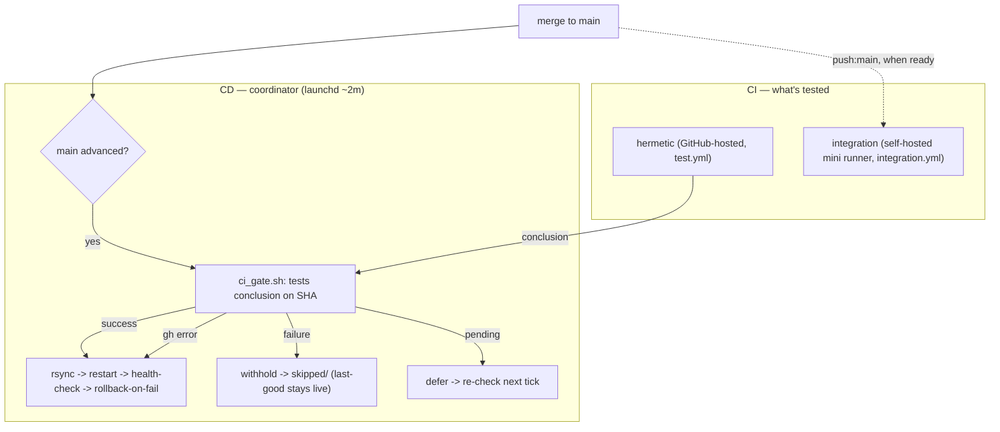

# PLAN — CI-gated CD + live-stack CI: the observability-config pilot, then the fleet

**Status:** proposed · **draft** · Phase 0 code-complete (PR #145) · **Date:** 2026-07-04
**Verdict (keep-most, add-two).** Keep the working pull-deploy coordinator and the free
GitHub-hosted hermetic tier; add exactly the two missing pieces — a **CI gate on the deploy**
and a **live-stack CI tier** on a self-hosted runner — and make **observability-config the
pilot**, then template the pattern across the new `robogeosociety` org. Not a big-bang
runner-driven pipeline: the mini is tailnet-only and RAM-tight (8 GB, shared by qwen + Grafana
+ InfluxDB + the obsidian-supervisor).
**Related:** [`CICD.md`](CICD.md) (operator runbook this proposes), `coordination/README.md` +
`COORDINATION-PLAN.md` (the deploy serializer this rides on), #143/#144 (the runner substrate).

---

## 1 · Problem

- **CD respected nothing.** `coordination/worker.sh` poll-deploys the instant `origin/main`
  advances, and branch protection can't gate merges (private repo, free plan: `Upgrade to
  GitHub Pro`) — so a red-CI merge went live within one ~2-min tick.
- **CI couldn't reach the stack.** The Tier-2 integration tests contact the live
  Grafana/InfluxDB on the box (`localhost:3001` / `:8086`), so they only ran locally, never in
  CI. GitHub-hosted runners can't reach the tailnet stack.
- **New fact (2026-07-04): the repo was transferred into the `robogeosociety` org.** That
  unlocks **org-level runners** and resolves the "stand up an org first?" open question in
  #143/#144 — one runner can now serve the whole fleet.

## 2 · Design & invariants

Two halves, adoptable independently:

- **CI-gate the coordinator** (`coordination/ci_gate.sh`) — teach the always-on pull-deploy to
  only ship a SHA whose `tests` workflow is green. No new runner, no RAM.
- **Live-stack CI** (`.github/workflows/integration.yml`) — run the integration tier on a
  self-hosted mini runner; GitHub-hosted keeps the hermetic tier.

Load-bearing invariants:

- **Degrade OPEN.** A broken gate (no `gh`, auth failure, API error) never *freezes* deploys —
  it only ever **withholds** on an affirmative not-green signal (`ci-failed`/`ci-pending`).
- **Behaviour-preserving Phase 0.** With no `GH_TOKEN` and a locked launchd keychain the gate
  degrades to today's blind poll-deploy — so this PR is safe to merge before anything is
  configured; the gate simply *starts working* once the token lands.
- **Keep the coordinator.** Pull-deploy + health-check + rollback already work; runner-driven
  CD would cost RAM and risk for no gain on a tailnet-only box.
- **Protect the 8 GB box.** Only the (light) integration tier runs on the runner; **e2e /
  Playwright stays maintainer-local** (Chromium is the heavy tenant).

## 3 · Phased rollout

| Phase | Change | Reversible |
|---|---|---|
| **0** (this PR) | `ci_gate.sh` + the `worker.sh` gate; **dormant** `integration.yml`; `CICD.md`; 6 gate tests | revert |
| **1** | Register **one org-level runner** (`GH_ORG=robogeosociety`, via #144's `setup.sh`); add read-only `GH_TOKEN` to the coordinator env; `gh variable set SELF_HOSTED_RUNNER ready` | delete var / unregister runner |
| **2** | **#142 = the first gated deploy** — its CI is already green; validates the whole path end-to-end | n/a |
| **3** | **Fleet templating** — the gate + integration pattern to other org repos (tommybot, rgs, …); shared org runner; a reusable workflow in the org `.github` repo | per-repo revert |

Phase 0 lands **behaviour-identical** (degrades open); every later phase is a config action the
maintainer takes, each independently reversible.

## 4 · Decisions already made

- **Admission-gate at deploy, not branch protection** — unavailable on this plan, and it gates
  the *actual* risk (a bad deploy) rather than just merge ordering.
- **Signal = the hermetic `tests` conclusion** on the head SHA (see §5.2 for whether to also
  require integration).
- **Reuse #144's installer; ONE org-level runner**, not per-repo instances (idle-RAM).
- **e2e stays local**; only the integration tier runs on the runner.

## 5 · Open decisions (for review)

1. **`GH_TOKEN` scope + home.** Proposed: a read-only fine-grained token (Actions:read +
   Contents:read) in `~/.observability/coordinator/env` (chmod 600), the same unattended-token
   pattern as `INFLUX_OPS_TOKEN`. Org-level vs repo-level token? Rotation cadence?
2. **Gate on integration too, or only hermetic?** Today the gate checks only the GitHub-hosted
   `tests` run. Requiring the **self-hosted integration tier** green before deploy would catch
   live-stack regressions pre-deploy — but couples deploy to runner availability + RAM (a down
   runner would block deploys unless that check *also* degrades open). Recommend: **hermetic-only
   to start**, revisit after the runner proves stable.
3. **Runner RAM policy.** Park during model-heavy windows (`SELF_HOSTED_RUNNER` unset), enforce a
   memory budget, or accept the serve idle-evicting during a job?
4. **`SELF_HOSTED_RUNNER` — repo var or org var?** Repo var = scoped per repo; org var = one
   fleet-wide "ready" flag as the pattern rolls out.
5. **Fleet-rollout mechanism (Phase 3).** A **reusable workflow** in the org `.github` repo
   (one source of truth, every repo calls it) vs. per-repo copies. Who owns the shared runner's
   lifecycle?

## 6 · Coordination with the runner PRs

- **#144** (bare-metal macOS runner) — **reused, not duplicated**: this PR ships no installer,
  points at `macos-runner/setup.sh`. [Comment left](https://github.com/robogeosociety/observability-config/pull/144)
  proposing org-mode + a `gh api` (no-PAT) registration token now that the org exists.
- **#143** (Linux/OrbStack runner) — orthogonal: cheap portable Tier-1 (lint/unit/build). The
  hermetic tier already runs free on GitHub-hosted, so observability-config doesn't need it — but
  it's the right home for heavier portable builds if the fleet wants self-hosted Tier-1.

## 7 · Risk & rollback

- **Additive, reversible** — a new file plus a guarded block in `worker.sh`; revert restores
  blind poll-deploy.
- **Self-propagating** — the coordinator hard-resets its internal clone to `main` each tick, so
  the first post-merge deploy runs the old worker once, then the gated one.
- **The one live dependency fails safe** — `GH_TOKEN` under launchd: absent/locked ⇒ degrade
  open (logged), never a frozen deploy.

## 8 · Flow

