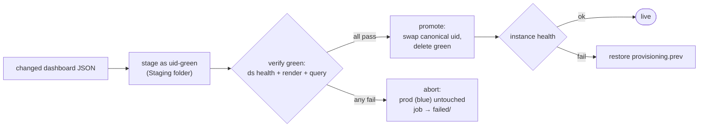

# COORDINATION-PLAN.md — concurrent dashboard contribution on one machine

How any project on `tommys-mac-mini` can land **a dashboard idea (an index entry)**
or **a full dashboard PR (JSON + datasource + intent)** at the same time as other
projects, without colliding — plus a scheduler and queue that serialize the few
steps that genuinely cannot run in parallel.

Status: **Phase 0 implemented and live** (`coordination/` — the deploy scheduler + mutex
+ queue, running under launchd); later phases and the blue-green stretch goal (§13) remain
proposed. Decisions confirmed: deploy **scheduling** is the priority; **no merge queue** —
merges go through normal squash PRs gated by the required `hermetic` check (§6).

---

## 1. Why this is needed — the collisions we actually hit

This isn't hypothetical. Building the `claude-usage` dashboard surfaced every class
of collision this plan exists to kill:

- **Static / git collision.** `dashboards.index.yaml` is **one file holding every
  dashboard's entry**. The moment `main` also gained `ha-pi-system`, our branch
  conflicted in that file and needed a manual rebase resolution. `datasources/influxdb.yml`
  is the same shape — one file, 9 bucket entries, every new datasource appends to it.
  With N projects contributing concurrently, these two files are a guaranteed conflict
  funnel.
- **Runtime / singleton collision.** Activation ran `deploy-provisioning.sh` (rsync +
  `docker restart grafana`), `docker compose up -d grafana` (recreate), and minted
  InfluxDB tokens. Two of those running at once would race the Grafana container and
  the provisioning dir. There is exactly **one** live Grafana and **one** internal
  provisioning copy — they must be mutated serially.
- **Logical collision.** The Grafana read token is **per-bucket**; adding `claude_code`
  meant minting a *fresh* token spanning all dashboard buckets + the new one. Two
  projects each adding a bucket and each minting "all buckets + mine" would clobber
  each other's grant. Token/bucket state is shared and must be reconciled, not raced.
- **TCC constraint.** The hub repo lives on `/Volumes/dev/observability`; **launchd
  cannot touch `/Volumes`** (exit 78). Any *scheduled* automation must run off the
  internal disk — the same rule that already forces `dev-status/` and the
  `claude-usage-collector` onto `~/.local`/`~/.observability`.

## 2. Goals / non-goals

**Goals**
- Two contribution lanes — **Idea** (index-only) and **PR** (full dashboard) — usable
  by any project concurrently with zero manual conflict resolution in the common case.
- A **scheduler** (launchd) and **queue** that serialize deploy/token/recreate.
- Idempotent, restart-safe, observable (logs + a heartbeat to the `ops` bucket).
- Stay inside existing patterns: dashboards-are-code, intent-is-code, internal-disk
  runtime, `gh`-driven PRs, hermetic CI.

**Non-goals**
- Don't rebuild a merge queue — **GitHub already serializes merges**; we lean on it.
- No new long-running server. The coordinator is a short launchd job that drains and exits.
- Not a multi-machine system; this is one Mac.

## 3. Collision taxonomy → the fix for each

| Class | Where | Fix (pillar) |
|---|---|---|
| Static (git) | shared `dashboards.index.yaml`, `datasources/influxdb.yml` | **conf.d split** — one file per dashboard/datasource (§5.1, §5.2) |
| Working tree | local agents sharing the `/Volumes` checkout | **worktree-per-task** (§5.3) |
| Merge ordering | two PRs touching `main` | **normal squash PRs + required CI** — no merge queue (§6) |
| Runtime singleton | deploy / `docker` recreate / provisioning rsync | **single coordinator daemon + mutex** (§5.4) |
| Logical (tokens/buckets) | per-bucket Grafana read token | **declarative `buckets.yaml` + reconcile** (§5.5) |

The principle: **make concurrent *additions* structurally conflict-free, and serialize
the irreducibly-shared *mutations* through one lock.**

## 4. Design overview — five pillars

1. **conf.d index & datasources** — adding a dashboard means adding *new files*, never
   editing a shared one. Disjoint new files merge cleanly in git.
2. **Worktree-per-task** — each local agent/project works in its own `git worktree`, so
   no two share a checkout or stomp `main`.
3. **GitHub for merges** — normal squash PRs gated by the required `hermetic` check; no
   merge queue (see §6). CI stays hermetic.
4. **One coordinator daemon** (launchd, internal-disk clone) — owns the serialized tail:
   deploy provisioning, recreate Grafana on datasource changes, reconcile tokens. Guarded
   by an atomic mutex so ticks/manual runs never overlap.
5. **Idea-intake queue** — a lightweight atomic file-drop queue for the "just log a
   dashboard idea" lane, drained by the same daemon into PRs.

## 5. Mechanics

### 5.1 conf.d for the intent index

Replace the monolith with a directory; the test aggregates it.

```
grafana/
  dashboards.index.d/
    backups.yaml          # one file per uid; content = { <uid>: { title, file, … } }
    claude-usage.yaml
    <uid>.yaml
```

- A new dashboard = a new `<uid>.yaml`. **No shared line is ever touched** → no conflict.
- `tests/test_dashboard_index.py` changes from "load one YAML" to "glob the dir, dict-merge,
  fail on duplicate uid." Duplicate-uid-across-files becomes an explicit, hermetic
  collision check (CI catches two projects grabbing the same uid).
- Migration is mechanical (one entry → one file) and can run alongside the monolith during
  Phase 1 (loader reads both, prefers `.d/`).

### 5.2 Per-project datasource files

Grafana's provisioner already scans **all** `*.yml` in `provisioning/datasources/`. So:

```
provisioning/datasources/
  influxdb.yml            # core/shared buckets (unchanged)
  _projects/
    claude_code.yml       # one datasource file per project-owned bucket
    <project>.yml
```

Adding a datasource = a new file under `_projects/` → conflict-free, same as the index.

### 5.3 Worktree-per-task (kills working-tree races)

Local agents must **not** all edit the `/Volumes` checkout. Each task gets an isolated
worktree off the shared object store:

```sh
git -C /Volumes/dev/observability worktree add -b <project>/<uid> \
    /Volumes/dev/.wt/<project>-<uid> origin/main
# …edit, test, commit, push, open PR from there…
git -C /Volumes/dev/observability worktree remove /Volumes/dev/.wt/<project>-<uid>
```

(Claude Code's own `isolation: "worktree"` agent mode is exactly this — agents that
mutate files in parallel should use it.) The human's primary `/Volumes` checkout stays
on `main` as the editing/source-of-truth copy.

### 5.4 The coordinator daemon + mutex (the serializer)

**TCC reality:** the daemon is launchd-scheduled, so it **cannot** operate on the
`/Volumes` repo. It works on an **internal-disk clone** of the GitHub remote and deploys
from there — purely internal-disk I/O, launchd-legal. The `/Volumes` checkout and the
coordinator's clone are two working copies of the *same* GitHub repo; `main` on GitHub is
the single source of truth.

```
~/.observability/coordinator/           # internal disk (launchd-safe)
  repo/                                  # git clone of robogeosociety/observability-config
  queue/        processing/  done/  failed/
  LOCK/                                  # mkdir-based mutex (present = held)
  buckets.yaml                           # declarative bucket→token state (§5.5)
  worker.sh   enqueue.sh
  com.tommy.observability-coordinator.plist
```

Deploy is re-pointed to rsync from `~/.observability/coordinator/repo/grafana/provisioning`
(already internal) → `~/.observability/grafana/provisioning` (what Grafana mounts). This
*generalizes* the post-#21 internal-disk move: the deployed artifact is "`main`, as the
coordinator checked it out," not "whatever branch the `/Volumes` tree happens to be on."
**This is a deliberate change to the operating model** and must be reflected in `CLAUDE.md`.

**Mutex** — atomic `mkdir` (portable, no `flock` on macOS, no deps):

```sh
LOCK=~/.observability/coordinator/LOCK
if mkdir "$LOCK" 2>/dev/null; then
  echo "$$ $(/bin/date +%s)" > "$LOCK/owner"
  trap 'rmdir "$LOCK" 2>/dev/null' EXIT
else
  # stale-lock reclaim: dead PID or age > 15m
  read -r pid ts < "$LOCK/owner" 2>/dev/null || exit 0
  if ! kill -0 "$pid" 2>/dev/null && [ $(( $(date +%s) - ts )) -gt 900 ]; then
    rm -rf "$LOCK"; exec "$0" "$@"        # one retry
  fi
  exit 0                                   # someone's working — next tick retries
fi
```

**Drain loop** (pseudocode):

```
acquire LOCK (else exit quietly)
cd repo; git fetch; git checkout main; git pull --ff-only
for job in queue/* sorted by filename-timestamp (FIFO):
    mv job processing/
    case job.type:
      idea:  write dashboards.index.d/<uid>.yaml from job.payload
             branch idea/<project>/<uid>; commit; push
             gh pr create  (+ auto-merge if pure-pending-doc and hermetic CI green)
      deploy: # enqueued by a post-merge hook when main's provisioning changed
             rsync provisioning → internal; 
             if datasources changed: docker compose up -d grafana   # recreate
             else:                    docker restart grafana         # reload only
             reconcile tokens (§5.5)
    on success → done/ ; on failure → failed/ + stderr (never block queue head)
emit heartbeat → ops bucket (measurement `coordinator`: ok/duration/jobs)
release LOCK
```

The LOCK guarantees the deploy/token/recreate section is single-flighted across every
launchd tick *and* any manual `worker.sh` run.

### 5.5 Declarative tokens/buckets (kills the logical collision)

`buckets.yaml` is the desired state; the daemon reconciles InfluxDB to match instead of
anyone hand-minting:

```yaml
buckets:
  - {name: claude_code, retention: 0, write_token_env: INFLUX_CLAUDE_USAGE_TOKEN}
grafana_read_token:
  env: INFLUX_GRAFANA_TOKEN          # ONE token; daemon ensures it reads every bucket below
  buckets: [tempest_archive, home_assistant, …, claude_code]
```

Reconcile step (idempotent, inside the LOCK): create any missing bucket; if `INFLUX_GRAFANA_TOKEN`
doesn't grant read on every listed bucket, mint a fresh all-buckets read token, write it to
`grafana/.env`, and flag a Grafana recreate. Because it's serialized and declarative, two
projects each adding a bucket converge to one correct token instead of clobbering.

## 6. The two contributor lanes

**Lane A — Idea (index-only, lightest):**
1. Project runs `coordinator/enqueue.sh --idea --uid <uid> --file intent.yaml`
   (atomic: write to `queue/.tmp.XXXX` then `mv` to `queue/<ts>-<project>-<uid>.job`).
2. Daemon turns it into `dashboards.index.d/<uid>.yaml` (a `status: pending` entry) on its
   own branch and opens a PR. New file ⇒ never conflicts. Optional auto-merge since it's
   doc-only and CI-validated.

**Lane B — Full PR (JSON + datasource + intent):**
1. Agent/project takes a **worktree** (§5.3), adds `dashboards.index.d/<uid>.yaml`,
   `provisioning/dashboards/<uid>.json`, and (if needed) `datasources/_projects/<x>.yml`
   and a `buckets.yaml` entry.
2. Opens a normal PR. **GitHub serializes the merge**; conf.d means the index/datasource
   files don't conflict; hermetic CI (incl. the duplicate-uid + bucket-declared checks)
   gates it.
3. A post-merge GitHub Action (or the daemon noticing `main` advanced) drops a
   `deploy` job → daemon does the serialized deploy/token/recreate.

Both lanes are concurrency-safe by construction; the only serialized resource (deploy) is
behind the queue+lock.

## 7. Scheduler

launchd `com.tommy.observability-coordinator`, `StartInterval` 120s, `RunAtLoad`, running
`~/.observability/coordinator/worker.sh` (internal disk). Quietly exits when the lock is
held or the queue is empty, so a 2-minute cadence is cheap. Log to
`~/Library/Logs/observability-coordinator.log`. (Same launchd/internal-disk pattern as
`com.tommy.dev-status` and `com.tommy.claude-usage`.)

## 8. CI collision guards (hermetic, add to the unit tier)

- **Duplicate uid** across `dashboards.index.d/*.yaml` → fail.
- **Every dashboard JSON's datasource uid** is declared (core `influxdb.yml` or
  `_projects/*.yml`).
- **Every datasource bucket** appears in `buckets.yaml` and in the read-token bucket list.
- Existing `test_dashboard_index.py` invariants (title/file/datasource sync) carry over to
  the per-file loader.

These turn "logical collisions" into red CI instead of silent runtime breakage.

## 9. Failure handling

- Jobs are idempotent and FIFO; a failed job moves to `failed/` with its stderr and is
  **skipped, not retried in a hot loop** (a `failed/` non-empty count is surfaced in the
  heartbeat). The queue head never blocks.
- Stale lock reclaim (dead PID + age) prevents a crashed run from wedging the scheduler.
- Deploy is last and idempotent: a re-run rsyncs the same `main` and is a no-op.

## 10. Phased rollout

- **Phase 0 — deploy serializer (highest ROI, smallest change). ✅ implemented and live.**
  `coordination/` ships the `mkdir` mutex (`mutex.sh`), the queue + drainer (`worker.sh`,
  deploy lane only, with post-deploy health verification + rollback), an atomic `enqueue.sh`,
  and an `install.sh` that stands up the internal-disk clone and the launchd job.
  `deploy-provisioning.sh` now takes the same mutex so an interactive preview-deploy can't
  race the scheduler. No dashboard/datasource format changes yet.
- **Phase 1 — conf.d index. ✅ done.** `dashboards.index.yaml` → `dashboards.index.d/<uid>.yaml`
  (one file per uid); `tests/test_dashboard_index.py` and the drift-sentinel both glob+merge
  the dir, with a hermetic duplicate-uid check. Kills the #1 git conflict. (The sibling
  append-only `changelog.jsonl` funnel is removed separately — derived from git via
  `render-changelog.py`.)
- **Phase 2 — datasources conf.d + `buckets.yaml` reconcile.** ✅ **conf.d done** — the
  monolithic `datasources/influxdb.yml` is split into one `influxdb-<bucket>.yml` per
  datasource (Grafana merges every `*.yml` in the dir), so adding a bucket is a new file,
  never a shared-file edit. The declarative token/bucket reconciliation in the daemon
  remains proposed.
- **Phase 3 — lanes + helpers.** `enqueue.sh`, worktree wrapper, idea-lane auto-merge,
  post-merge deploy-job hook. Update `CLAUDE.md` for the internal-clone deploy model.

## 11. Alternatives considered

- **Keep the monolith, serialize with a global lock for *all* edits.** Rejected: serializing
  *contribution* (not just deploy) throttles parallelism and still produces git conflicts on
  the shared file. conf.d removes the conflict at the source; the lock should guard only the
  true singleton (deploy).
- **A custom local merge queue.** Rejected: normal squash PRs + the required `hermetic`
  check already order merges well enough for a solo repo; don't reinvent a queue.
- **Run the daemon against the `/Volumes` checkout.** Impossible under launchd (TCC exit 78);
  hence the internal clone.
- **One datasource/index file edited via a YAML-merge tool.** Rejected: still a shared-file
  write; conf.d is simpler and git-native.

## 12. Risks & decisions

- **Two deploy paths, one lock.** Interactive `deploy-provisioning.sh` (preview *local*
  `/Volumes` edits, run by a human) and the coordinator (deploy *merged main* from the
  internal clone) now both take the `coordination/` mutex, so they can never race the
  provisioning dir or the Grafana container. Preview-from-`/Volumes` stays available
  precisely so you don't have to commit to see a change live.
- **Merge queue — decided against.** GitHub rulesets/merge-queue require GitHub Pro or a
  public repo (private/free returns 403), and merge *ordering* is a low-stakes race for a
  solo repo. Merges go through normal squash PRs gated by the required `hermetic` check; the
  deploy serializer (§5.4) covers the real runtime collision risk. (Revisit only if the repo
  goes Pro/public *and* contention actually appears.)
- **Auto-merge scope** for the idea lane — restrict to pure `status: pending` doc additions
  (full PRs always get human review). *Recommended; deferred to Phase 3.*
- **`buckets.yaml` as bucket source of truth** (Phase 2) means the daemon needs an admin
  Influx token in its internal-disk env (chmod 600), like the backup job already does.
- Worktrees live under `/Volumes/dev/.wt/` — add to `.gitignore` and clean on task end.

## 13. Stretch goal — blue-green dashboard deploys with verification

Phase 0 verifies the *instance* is healthy after a deploy and rolls the whole provisioning
dir back if not. The stretch goal makes verification **per-dashboard and pre-promotion**, so
production never serves a broken dashboard even briefly.

**Why a true blue-green is awkward here:** there's one Grafana instance, and dashboards are
provisioned by `uid`. So "green" isn't a second server — it's the changed dashboards
provisioned under a **staging identity** (a `Staging` folder + `-green` uid suffix) that real
users don't navigate to.



**Flow (inside the coordinator's deploy lock):**
1. **Stage (green).** For each *changed* dashboard JSON, write a transformed copy into a
   `staging/` provider folder with `uid → <uid>-green`, datasources untouched. rsync +
   reload. Production (`blue`) is still the live `<uid>` — untouched.
2. **Verify green.** Reuse the primitives this repo already proved out:
   - **Datasource health** — `/api/datasources/uid/<ds>/health` returns OK.
   - **Render** — `grafana-image-renderer` `GET /render/d-solo/<uid>-green/...` per panel
     returns a non-trivial PNG (size over a floor, not an error card).
   - **Query** — `/api/ds/query` for each panel returns frames with no error and (for
     panels expected to have data) at least one non-null point in the window.
   A per-dashboard `verify.yaml` can declare expectations (panels that may legitimately be
   empty, min bytes, query row floors) so verification isn't brittle.
3. **Promote or abort.**
   - All green probes pass → promote: swap the canonical `<uid>` provisioning file to the
     new JSON, reload, then delete the `-green` staging copy. Blue is now the new version.
   - Any probe fails → **abort**: leave blue (current prod) exactly as-is, drop the deploy
     job to `failed/` with the probe report, and leave green in `Staging` for inspection.
4. **Post-promote guard.** Re-run the instance health check (Phase 0); on failure, restore
   from the `provisioning.prev` snapshot.

**Properties:** prod is only ever swapped to a dashboard that already rendered and queried
clean; a bad JSON, a dangling datasource ref, or an empty-by-mistake panel is caught in green
and never promoted. Verification is deterministic (renderer PNGs + `ds/query`), so it runs
headless under the launchd worker. **Cost:** a transform/stage step and N renderer calls per
changed dashboard per deploy — bounded by *changed* dashboards, not the whole set.

**Build order:** lands after Phase 1 (conf.d makes "which dashboards changed" a clean
file-diff) as **Phase 4**; the verification harness can reuse `grafana/playwright/` and the
renderer wiring already in the repo.
