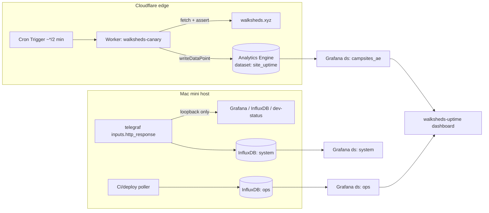

# Cloudflare-native endpoint / canary monitoring — migration plan

Status: **proposal / research**. Scope: replace the stack's host-based synthetic
endpoint monitoring with Cloudflare-native primitives **where the edge can actually
reach the target**. No live changes here — this is a plan to be split into PRs per
`AGENTS.md` (edit source, open PR, the coordinator deploys).

## TL;DR — recommendation

- **Move `walksheds.xyz` public-site uptime to a Cloudflare Worker canary** on a Cron
  Trigger that `fetch()`es the site, asserts status/latency, and `writeDataPoint()`s to
  **Workers Analytics Engine** (AE). Surface it in Grafana via the **existing**
  `campsites_ae` ClickHouse-over-AE datasource pattern. This reuses the proven
  robot-geographical-society (RGS) AE wiring already in this repo, keeps `walksheds`'s
  CI/deploy signals on GitHub's API, and lets us **retire the `walksheds-uptime` launchd
  job** entirely.
- **Do NOT use Cloudflare Standalone Health Checks** as the primary for walksheds:
  they're Pro+ (paid, per-zone) and the target's address must live in a Cloudflare zone
  on the account — `walksheds.xyz` is GitHub-Pages-hosted (open question whether its DNS
  is even on Cloudflare). A Worker canary has no such constraint, runs on the existing
  Workers Paid plan, and writes to the AE datasets we already query.
- **Keep all telegraf `inputs.http_response` probes on the host. They cannot move.**
  They probe `127.0.0.1:3001` (Grafana), `localhost:8086` (InfluxDB), and `:8077`
  (dev-status) — loopback/tailnet-only services with **no public-internet route**, so the
  Cloudflare edge can never reach them. This is a hard constraint, not a preference.
- **Browser Rendering (Puppeteer) canaries** are available and cheap-at-our-volume, but
  are **over-spec for walksheds today** (a static site; an HTTP probe + body assertion is
  enough). Hold it as a documented option for a future DOM/visual canary.

Net: one monitor moves to the edge (walksheds uptime), one class stays host-side forever
(localhost/tailnet probes), and the GitHub-sourced CI/deploy signals stay on the GitHub API
(just need re-homing off the retired launchd job — see §6).

## 1. Current state (what exists today)

| Monitor | Mechanism | Target | Reachable from CF edge? | Writes to |
|---|---|---|---|---|
| `walksheds.xyz` uptime | `walksheds-uptime` launchd job (`grafana/walksheds-uptime/collector.py`), every 120 s | **public** `https://walksheds.xyz/` | **Yes** | `ops` bucket — `uptime{service=walksheds}` (`up`, `latency_ms`, `status`) |
| walksheds CI smoke | same job, GitHub Actions API | `smoke.yml` runs | n/a (API poll, not a probe) | `ops` — `ci_smoke` (`ok`, `duration_s`) |
| walksheds deploys | same job, GitHub Deployments API | `github-pages` env | n/a (API poll) | `ops` — `deploy` (`ok`, tag `state`) |
| Grafana health | telegraf `inputs.http_response` | `http://localhost:3001/api/health` | **No** (loopback) | `system` — `http_response` |
| InfluxDB health | telegraf `inputs.http_response` | `http://localhost:8086/health` | **No** (loopback) | `system` — `http_response` |
| dev-status health | telegraf `inputs.http_response` | `http://localhost:8077/` | **No** (loopback) | `system` — `http_response` |

Dashboards / alerting that consume the above:
- `grafana/provisioning/dashboards/ops/walksheds-uptime.json` (uid `walksheds-uptime`,
  datasource `ops`) — status, range-uptime %, latency, CI smoke, deploys, up/down timeline.
- `grafana/provisioning/dashboards/ops/status-page.json` (uid uses the Infinity
  `uptime_status` datasource over public JSON; **not** the telegraf probes).
- Alerting: there is **no** dedicated walksheds availability rule today;
  `collector-freshness.yml` does not cover `ops` (it's excluded), and
  `influxdb-availability.yml` watches the `system` bucket, not the public probe.

**Existing Cloudflare/AE pattern to reuse** (don't reinvent):
- Account `tommyroar-dev` / `d7adee58513c1b2f770ccaac90cf114f`, on **Workers Paid**.
- RGS Worker `robot-geographical-society-backend` already emits AE datasets
  (`campsite_collector`, `campsite_collector_runs`, …) via `writeDataPoint`.
- Datasource `campsites_ae` (`grafana/provisioning/datasources/campsites-ae.yml`):
  `vertamedia-clickhouse-datasource` POSTing SQL to the AE SQL API with
  `Authorization: Bearer ${CF_ANALYTICS_TOKEN}` (token scope: **Account → Account
  Analytics → Read**). Plugin already in `GF_INSTALL_PLUGINS`; token already in the live
  `grafana/.env`.
- Datasource `cloudflare_graphql` (Infinity) for GraphQL Analytics (R2 metrics) — same token.

## 2. Cloudflare options compared

| Option | What it does | Cost (our account) | Fit for walksheds | Key limitations |
|---|---|---|---|---|
| **Standalone Health Checks** | CF-managed monitor of an address (HTTP/HTTPS/TCP) from CF regions, near-real-time email/webhook/PagerDuty notify | **Pro 10 / Business 50 / Enterprise 1,000** checks; **not on Free**. Per-zone. | **Poor** | Target address must be in a **Cloudflare zone on the account**; walksheds.xyz is GitHub Pages (DNS-on-CF unconfirmed). Paid tier we don't have. Results live in CF analytics, **not** in AE/Grafana without extra plumbing. |
| **Worker + Cron Trigger → AE** *(recommended)* | A Worker `scheduled()` handler `fetch()`es any public URL, asserts status/latency/body, `writeDataPoint()`s the result | Cron + Workers: on existing **Workers Paid**. AE: free tier 100k writes/day, 10k reads/day; paid 10M writes + 1M reads/mo included (CF currently not billing AE). | **Strong** | Cron min granularity **1 minute** (vs 120 s today — fine). AE is **sampled** — weight counts by `SUM(_sample_interval)`. AE retention **3 months**. No built-in alerting (Grafana rules do it). |
| **Browser Rendering / Puppeteer (Workers Binding)** | Real headless-Chrome canary: full page load, DOM/visual assertions, screenshot | Paid: 10 browser-hours/mo included, then $0.09/hr; 10 concurrent included. Free: 10 min/day, 3 concurrent. | **Overkill now** (static site) | Heavier + slower; per-session browser time billed. Reserve for a future DOM/visual canary. |
| **Web Analytics / Observatory / Speed** | RUM + scheduled Lighthouse-style page-speed (Observatory) | Free/Pro | **Adjacent, not uptime** | Measures real-user perf / scheduled Lighthouse, **not** a synthetic up/down probe. Observatory needs the zone on CF. Optional later signal, not a replacement. |
| **DEX synthetic tests** (Cloudflare One / Zero Trust) | Scheduled HTTP GET + traceroute against **any public hostname** from CF's network (and enrolled WARP devices); status-code time series + hop-by-hop path telemetry | **Free on all Zero Trust plans** | **Viable alt** | Probes non-CF hostnames (works for GitHub-Pages walksheds), but results live in the **Zero Trust DEX dashboard, not AE/Grafana** — no unified pane without export. HTTP **GET only**, no body/latency-budget assertions. Per-test interval floor. |
| **Load Balancing health monitors** | Origin/pool monitors, multi-region, Monitor Groups | **Enterprise + LB subscription** | **No fit** | Targets a CF-proxied origin/pool, not an arbitrary URL; gated to a plan we don't have. |
| **Cloudflare Notifications** (Origin Error Rate / Health-Check status / Workers errors) | Event alerts off **real traffic** through a CF zone | Free–Pro by type | **Passive, not synthetic** | No active probe; needs traffic *through* a CF zone (N/A for GitHub-Pages walksheds, but relevant for the proxied `*.robogeosociety.xyz` apps). |
| **Durable Object alarms** (as canary scheduler) | Stateful, **sub-1-minute** scheduling + flap/streak state for a Worker canary | On Workers Paid | **Upgrade path** | Only needed if checks must run faster than Cron's 1-min floor or hold streak state; otherwise Cron is simpler. |

### Why Worker-canary over Health Checks (the decision)

1. **No zone requirement.** A Worker `fetch()` reaches any public URL; Health Checks need
   the address inside a CF zone on the account.
2. **Already paid for.** Workers Paid + AE are live; Health Checks need Pro+.
3. **Same sink as everything else.** Results land in AE → the `campsites_ae` datasource we
   already provision and query. One Grafana pattern, not a new CF-analytics surface.
4. **Assertions are code.** Status range, latency budget, and body-substring checks live in
   the Worker — richer than a Health Check's expected-codes match.

### DEX synthetic tests — the one real alternative

[DEX synthetic application monitoring](https://developers.cloudflare.com/cloudflare-one/insights/dex/tests/)
(part of Cloudflare One / Zero Trust) is the only *other* option that genuinely fits the
"probe a public site from Cloudflare's network" shape, so it's worth a deliberate weigh-up
rather than a one-line dismissal:

- **What it gives us, for free.** Scheduled HTTP GET + traceroute against any public hostname
  — including GitHub-Pages `walksheds.xyz` (no CF zone required) — with a status-code time
  series and hop-by-hop path telemetry, on **every Zero Trust plan at no extra cost**. Zero
  code, zero Worker to maintain.
- **Why it still loses to the Worker canary *here*.** Its results live in the **Zero Trust DEX
  dashboard**, not in Analytics Engine — so they never reach the `campsites_ae` Grafana
  datasource, breaking the "one Grafana pane" goal that motivates this whole plan. It's also
  **GET-only**: no latency-budget or body-substring assertion, which the Worker does in code.
- **Where it would win.** If we ever want *network-path* diagnosis (which hop is slow/dropping)
  or end-user-perspective probes from enrolled WARP devices, DEX is the right tool and the
  Worker canary isn't — they're complementary, not redundant.
- **Verdict.** Keep the Worker→AE canary as the primary (Grafana-native). Optionally stand up a
  **DEX synthetic test for walksheds in parallel** — it's free and adds path telemetry the
  Worker can't — and treat its dashboard as a secondary, CF-side view. Revisit DEX-over-Worker
  only if we abandon the single-Grafana-pane requirement.

**Passive companions (not synthetic, but relevant signal):** for the *proxied*
`*.robogeosociety.xyz` apps (which the Worker/webapp already serve through CF), **Origin Error
Rate Notifications** and the **GraphQL Analytics API** give real-traffic 5xx/health alerting
for free — the GraphQL feed can land in Grafana via the **Infinity** datasource (the same
pattern `campsite-collector-history` already uses for R2 GraphQL). And building the canary as a
Worker gets **Workers Observability** (invocation logs, error-rate metrics, Query Builder) on
the canary itself at no extra cost.

## 3. Target architecture



**Disposition of each monitor:**

| Monitor | Moves to | Rationale |
|---|---|---|
| walksheds.xyz uptime/latency | **Worker canary → AE** | Public target, edge-reachable, reuses AE pattern |
| walksheds CI smoke / deploys | **stays GitHub-API**, re-homed off launchd | Not a probe; it's GitHub state. CF edge adds nothing. See §6. |
| Grafana / InfluxDB / dev-status http_response | **STAYS on telegraf (host)** | Loopback/tailnet-only — **edge cannot reach**. Permanent. |

## 4. Migration steps — walksheds.xyz (do this first)

These split into two PRs: one in **robot-geographical-society** (or a new tiny Worker repo)
for the Worker, one **here** for the Grafana datasource/dashboard. This repo's PR is the
store-as-code half.

### 4a. Worker (other repo — `robot-geographical-society` or new `walksheds-canary`)

`wrangler.toml`:

```toml
name = "walksheds-canary"
main = "src/index.ts"
compatibility_date = "2026-06-01"

[triggers]
crons = ["*/2 * * * *"]   # every 2 min — matches today's 120s cadence; 1 min is the floor

[[analytics_engine_datasets]]
binding = "SITE_UPTIME"
dataset = "site_uptime"
```

`src/index.ts` (assert status + latency, write one AE point per probe):

```ts
export default {
  async scheduled(_ctrl: ScheduledController, env: Env, _ctx: ExecutionContext) {
    const url = "https://walksheds.xyz/";
    const t0 = Date.now();
    let status = 0, ok = 0, bodyOk = 0;
    try {
      const r = await fetch(url, { redirect: "manual", cf: { cacheTtl: 0 } });
      status = r.status;
      ok = status >= 200 && status < 400 ? 1 : 0;
      const text = await r.text();
      bodyOk = text.includes("<title") ? 1 : 0;   // cheap content assertion
    } catch { /* status stays 0 → down */ }
    const latency_ms = Date.now() - t0;
    env.SITE_UPTIME.writeDataPoint({
      indexes: ["walksheds"],                       // sampling key = service
      blobs: ["walksheds", url, String(status)],    // blob1 service, blob2 url, blob3 status
      doubles: [ok, latency_ms, bodyOk],            // double1 up, double2 latency_ms, double3 body_ok
    });
  },
} satisfies ExportedHandler<Env>;
```

AE contract (document this as authoritative, like the RGS datasets):

| field | meaning |
|---|---|
| `index1` | service (`walksheds`) — sampling key |
| `blob1` / `blob2` / `blob3` | service / url / http status string |
| `double1` / `double2` / `double3` | `up` (1/0) / `latency_ms` / `body_ok` (1/0) |

Limits respected: 1 index, ≤20 blobs/doubles, ≤250 points/invocation, 3-month retention
(plenty for an uptime dashboard). AE is sampled — **weight every count by
`SUM(_sample_interval)`**.

### 4b. Grafana (this repo — the PR that belongs here)

The `campsites_ae` datasource + plugin already exist, so **no new datasource is strictly
required** if `site_uptime` lives in the same account (it does). Two clean options:

- **Reuse `campsites_ae`** — point new panels at uid `campsites_ae`, just change the `FROM`
  table to `site_uptime`. Zero datasource churn.
- **Add a dedicated datasource** `grafana/provisioning/datasources/walksheds-ae.yml`
  (copy `campsites-ae.yml`, new `uid: walksheds_ae`, same URL/token) if we want isolation.
  One-file-per-datasource conf.d (see AGENTS.md). Recommend **reuse** to avoid sprawl.

Repoint `walksheds-uptime.json` panels from Flux/`ops` to AE SQL. Example for the
range-uptime % stat (sampling-weighted):

```sql
SELECT
  SUM(_sample_interval * double1) / SUM(_sample_interval) * 100 AS uptime_pct
FROM site_uptime
WHERE index1 = 'walksheds'
  AND timestamp > now() - INTERVAL '24' HOUR
```

Latency timeseries (bucketed by Grafana zoom — use the plugin's time macros, as the RGS
dashboards do):

```sql
SELECT toStartOfInterval(timestamp, INTERVAL 5 MINUTE) AS t,
       SUM(_sample_interval * double2) / SUM(_sample_interval) AS latency_ms
FROM site_uptime
WHERE index1 = 'walksheds' AND $timeFilter
GROUP BY t ORDER BY t
```

Up/down state-timeline: `double1` (max per bucket → up if any success), mapped 1→up/0→down.

Keep the **CI smoke** and **deploys** panels on the `ops` bucket (they're GitHub-sourced,
not a probe). So the migrated `walksheds-uptime.json` becomes **mixed-datasource**: AE for
uptime/latency, `ops` for CI/deploy. Update the sidecar
`grafana/dashboards.index.d/walksheds-uptime.yaml` `datasources:` list to include
`campsites_ae` (or `walksheds_ae`) — `tests/test_dashboard_index.py` enforces this.

### 4c. Token / secret

`CF_ANALYTICS_TOKEN` (Account → Account Analytics → **Read**) already grants AE SQL reads
across the account, so it covers `site_uptime` too — **no new Grafana secret**. The Worker
needs only its AE binding (no token). Nothing new lands in `grafana/.env`.

## 5. Alerting

Today there is **no** walksheds availability alert. Two ways to add one post-migration:

| Approach | Where | Pros | Cons |
|---|---|---|---|
| **Grafana rule on the AE datasource** *(recommended)* | this repo, `grafana/provisioning/alerting/walksheds-availability.yml` | Same Discord contact point + newspaper-style embed as every other rule; store-as-code; one notification surface | AE SQL in a Grafana rule is newer ground than Flux; needs a freshness-style guard so an AE query hiccup doesn't false-fire |
| **Cloudflare Notifications** (if we adopted Health Checks) | CF dashboard | CF-native, independent of Grafana | Needs Pro+ and a CF zone; **splits** alerting off our single Discord path; not store-as-code |

Recommended rule shape (mirrors the existing convention — `noDataState`/`execErrState`
chosen so an AE outage doesn't page per-rule): fire when, over the last ~15 min,
`SUM(_sample_interval * double1) / SUM(_sample_interval) < 1` for `index1='walksheds'`
(any failed probe), `for: 5m`, routed to the existing Discord contact point. Embed the
`walksheds-uptime` up/down panel via `__dashboardUid__`/`__panelId__`.

Note: a Grafana-hosted rule shares the **same blind spot** flagged in CLAUDE.md — it can't
detect its own outage. The host `watchdog/` job remains the external backstop for the
stack itself; it does **not** watch walksheds (different concern).

## 6. Dashboards repoint + launchd deprecation path

1. **Land the Worker** (other repo) — confirm `site_uptime` rows appear via the AE SQL API
   (`curl` the SQL endpoint with `CF_ANALYTICS_TOKEN`), exactly as RGS was verified.
2. **PR here**: repoint `walksheds-uptime.json` uptime/latency panels to AE; keep CI/deploy
   on `ops`; update the `.index.d` sidecar; add `walksheds-availability.yml`. Run
   `grafana/run-tests.sh unit`. Open PR (newspaper body). Human merges → coordinator deploys.
3. **Re-home the GitHub CI/deploy poll.** It still feeds the `ci_smoke`/`deploy` panels and
   is *not* edge-movable. Options, in order of preference:
   - **GitHub Actions in the `walksheds` repo** push `ci_smoke`/`deploy` line protocol to a
     small ingest (or to AE via a second Worker) — removes the host job cleanly; **but** the
     home InfluxDB isn't reachable from GitHub-hosted runners (the original reason this was a
     host collector), so this means moving those two signals to **AE** too (Worker receives a
     webhook / Actions calls a Worker that `writeDataPoint`s).
   - **Trim the launchd job** to only the GitHub poll (drop `probe_site`) and keep it
     host-side as the smallest possible bridge. Lowest effort; keeps one launchd job alive.
4. **Deprecate `walksheds-uptime` launchd job.** Once uptime is on AE and CI/deploy are
   re-homed: `launchctl bootout` the job, delete `grafana/walksheds-uptime/` (collector,
   plist, deploy.sh, README, `.env.example`), and remove its `dashboard_coverage.yaml`
   entry. Note the maintainer does the `launchctl`/deploy (AGENTS.md: agents don't mutate
   the live stack). If step 3 chose the "trim" option, the job survives in slimmed form and
   only `probe_site` is removed.
5. **telegraf probes untouched** — `inputs.http_response` stays exactly as-is.

## 7. What explicitly does NOT move (hard constraint)

The telegraf `inputs.http_response` block probes **loopback/tailnet-only** endpoints:

- `http://localhost:3001/api/health` (Grafana — bound to `127.0.0.1`, tailnet-served)
- `http://localhost:8086/health` (InfluxDB — localhost)
- `http://localhost:8077/` (dev-status collector)

None has a public-internet route, so **no Cloudflare edge primitive can reach them** — not
Health Checks, not a Worker `fetch()`, not Browser Rendering. They must stay on host
telegraf. (A Cloudflare Tunnel could expose them, but exposing internal health endpoints to
the edge to monitor them is strictly worse than the in-house telegraf probe and adds attack
surface — explicitly rejected.)

## 8. Open questions / risks

- **Is `walksheds.xyz` DNS on Cloudflare?** Decides whether Health Checks / Observatory are
  even *possible* later. Doesn't block the Worker-canary plan (which needs no zone).
- **AE sampling at low volume.** At one probe / 2 min, sampling should be ~1:1, but every
  query must still weight by `SUM(_sample_interval)` to stay correct if CF ever samples.
- **AE 3-month retention** vs the dashboard's 7d/30d windows — fine; but any "all-time
  uptime" ambition needs a rollup (out of scope).
- **Mixed-datasource dashboard** (AE + `ops`) — confirm `test_dashboard_index.py` accepts
  multiple datasources in the sidecar (it already does for other dashboards; verify).
- **CI/deploy re-homing** is the fiddly part — the home InfluxDB's unreachability from
  GitHub runners is exactly why this was a host job; moving it to AE means a second small
  Worker or webhook. Lowest-risk interim: keep a slimmed launchd poller.
- **Cron floor is 1 min**; we lose nothing vs 120 s, but sub-minute probing isn't possible
  on Cron Triggers (would need Durable Object alarms — out of scope).
- **No new secret**, but the Worker lives in another repo — coordinate the two PRs so the
  Grafana panels don't render *No data* before the Worker emits.

## Sources

- Standalone Health Checks — <https://developers.cloudflare.com/health-checks/>
  (plan availability: Free 0 / Pro 10 / Business 50 / Enterprise 1,000)
- Workers Analytics Engine — <https://developers.cloudflare.com/analytics/analytics-engine/>
- AE get-started (`writeDataPoint`, wrangler binding, SQL API) —
  <https://developers.cloudflare.com/analytics/analytics-engine/get-started/>
- AE limits (20 blobs/doubles, 1 index, 250 pts/invocation, 16 KB blobs, 3-month retention) —
  <https://developers.cloudflare.com/analytics/analytics-engine/limits/>
- AE pricing (free 100k writes + 10k reads/day; paid 10M writes + 1M reads/mo) —
  <https://developers.cloudflare.com/analytics/analytics-engine/pricing/>
- Cron Triggers (5-field cron, 1-min floor, `scheduled()`) —
  <https://developers.cloudflare.com/workers/configuration/cron-triggers/>
- Browser Rendering pricing (10 hrs/mo paid, $0.09/hr; 10 min/day free) —
  <https://developers.cloudflare.com/browser-rendering/platform/pricing/>
- DEX synthetic tests (HTTP GET + traceroute, free on Zero Trust) —
  <https://developers.cloudflare.com/cloudflare-one/insights/dex/tests/>
- Load Balancing monitors / Monitor Groups (Enterprise) —
  <https://developers.cloudflare.com/load-balancing/monitors/>
- Workers Observability (logs, metrics, Query Builder) + Origin Error Rate notifications —
  <https://developers.cloudflare.com/workers/observability/>
- In-repo prior art: `cloudflare-collector/README.md`, `grafana/provisioning/datasources/campsites-ae.yml`,
  `grafana/walksheds-uptime/` (collector being retired).
