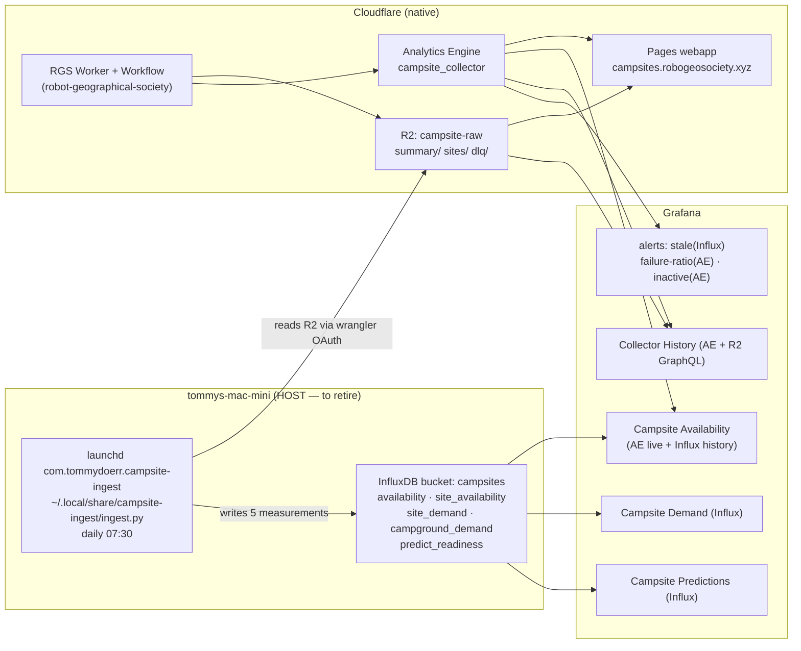
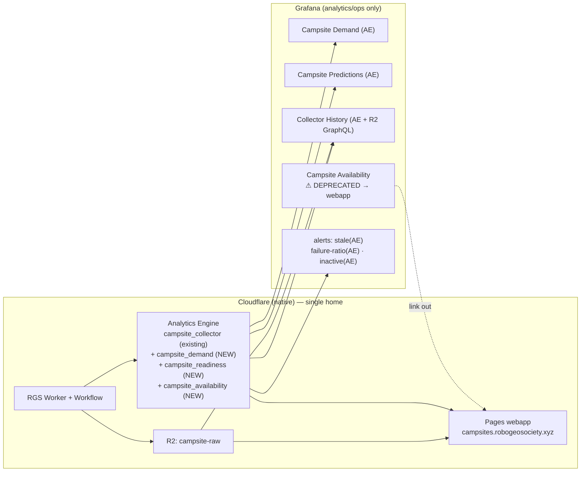

# Cloudflare Migration Plan — Campsite Collector Monitoring

Move **all** campsite collector monitoring off `tommys-mac-mini` to native Cloudflare.
The collector itself (`robot-geographical-society`, "RGS") already runs at the edge and
writes Cloudflare Analytics Engine (AE); what remains host-side is the *monitoring tail* —
a launchd ingest job, an InfluxDB bucket, three InfluxDB-backed dashboards, and one
InfluxDB alert. This plan retires that tail.

---

## TL;DR

| | |
| --- | --- |
| **Goal** | Zero host dependency for campsite monitoring — no `com.tommydoerr.campsite-ingest`, no InfluxDB `campsites` bucket. |
| **Mechanism** | Extend the RGS Worker to emit the demand / readiness / availability aggregates the Mac currently computes, into **Analytics Engine** datasets. Repoint Grafana from the `campsites` InfluxDB datasource → the existing `campsites_ae` (ClickHouse-over-AE) datasource. |
| **Data explorer** | The interactive **Campsite Availability** dashboard is superseded by the **webapp** (`campsites.robogeosociety.xyz`). Deprecate the explorer panels; keep Grafana for trend/ops analytics only. |
| **Keeps** | `Campsite Demand`, `Campsite Predictions`, `Collector History` dashboards — repointed to AE, not retired. |
| **Net effect** | One launchd job, one Influx bucket, one Influx datasource, and one Influx alert removed. The Mac stops doing campsite work entirely. |

---

## Why

1. **The collector is already native CF; the monitoring isn't.** RGS (Worker + Workflow + R2 + AE + Pages webapp, account `d7adee58513c1b2f770ccaac90cf114f`) is fully edge-resident. The only reason monitoring touches the Mac is the **`campsites/ingest.py`** job that reads R2 and recomputes aggregates into InfluxDB so Grafana can render them.
2. **The ingest job is the most fragile link in the stack.** It fights macOS TCC: a launchd-spawned `python3`/`uv` hangs on `/Volumes` reads *and* its own TLS, so it runs from an internal-disk copy (`~/.local/share/campsite-ingest/`) deployed by `campsites/deploy.sh`. Removing it removes a whole class of `/Volumes`+TCC + deploy-copy breakage.
3. **The explorer is now redundant.** The webapp (`campsites.robogeosociety.xyz`, React 19 + Mapbox) gives a strictly better interactive availability UX than the Grafana explorer — night picker, per-campground drill-down, per-site search/filter/calendar, plus map/survival/layout views Grafana never had.
4. **AE is the right store for this shape.** Per-run, per-site, sampled event metrics are exactly Analytics Engine's model; the RGS Worker already `writeDataPoint()`s the `campsite_collector` dataset that `campsite_collector_history` + two alerts read today.

---

## Architecture — before



## Architecture — after



**Gone after migration:** `com.tommydoerr.campsite-ingest` launchd job · `~/.local/share/campsite-ingest/` ·
InfluxDB `campsites` bucket · `influxdb-campsites.yml` datasource · `campsites/` ingest code (archived) ·
the Mac's wrangler-OAuth read path for R2.

---

## What moves where

| Current (host) | Becomes (native CF) | Notes |
| --- | --- | --- |
| `ingest.py` → `availability` measurement | RGS Worker → AE `campsite_availability` | Per-campground per-target_date aggregate; the Worker already has the summary JSON it would aggregate. |
| `ingest.py` → `site_demand` / `campground_demand` | RGS Worker → AE `campsite_demand` | Demand = derivative over the capture window; compute in the Workflow's post-collect step. |
| `ingest.py` → `predict_readiness` | RGS Worker → AE `campsite_readiness` | Formula already lives in RGS `predict/readiness.py` — the Mac copy in `ingest.py:compute_readiness()` is a *duplicate to delete*, removing the sync hazard. |
| `site_availability` measurement | Webapp (per-site calendar) | Per-site/per-night detail is an *interactive* concern → webapp, not a dashboard. |
| InfluxDB `campsites` datasource | `campsites_ae` datasource | Already provisioned (`campsites-ae.yml`, ClickHouse plugin, `Bearer ${CF_ANALYTICS_TOKEN}`). |
| `campsite-collector-stale` alert (Influx) | AE freshness rule | Re-express against `campsite_collector` (or new `campsite_availability`) on `campsites_ae`. |

---

## Migration steps

> Two repos are in play: **`tommyroar/robot-geographical-society`** (the Worker + AE writes +
> webapp) and **`tommyroar/observability-config`** (Grafana dashboards/alerts/datasources, this
> repo). Land the Worker AE-write change *first* so the new datasets have data before any
> dashboard repoints to them.

### Phase 1 — RGS Worker: emit the aggregates to AE *(robot-geographical-society repo)*

1. In the Workflow's post-collect/aggregation step, after writing `summary/{date}` and
   `sites/{date}` to R2, also `writeDataPoint()` to three new AE datasets:
   - `campsite_availability` — one point per campground per target_date: `index1=guid`,
     `blob1=target_date`, `blob2=agency`, `blob3=name`, `double1=available`, `double2=reserved`, `double3=total`.
   - `campsite_demand` — per campground: `index1=guid`, `blob2=agency`, `blob3=name`,
     `double1=available_nights`, `double2=reserved_nights`, `double3=total_nights`.
   - `campsite_readiness` — one global point per run from `predict/readiness.py`:
     `double1=readiness`, `double2=event_score`, `double3=coverage`, `double4=depth_score`,
     `double5=events`, `double6=active_cells`, `double7=cells`, `blob1=band`, … (mirror the
     `predict_readiness` field set verbatim so dashboards port 1:1).
2. **Delete** the duplicated readiness math from the Mac `ingest.py` plan — it is superseded by
   the Worker's canonical `predict/readiness.py` (this kills the documented "formula must stay
   synchronized" hazard between the two repos).
3. Deploy the Worker; let it run ≥2 cycles so AE has a populated window (AE retains ~3 months).
4. Verify with AE SQL (same endpoint Grafana uses):
   ```sh
   curl -s https://api.cloudflare.com/client/v4/accounts/d7adee58513c1b2f770ccaac90cf114f/analytics_engine/sql \
     -H "Authorization: Bearer $CF_ANALYTICS_TOKEN" \
     --data "SELECT count() FROM campsite_availability WHERE timestamp > NOW() - INTERVAL '2' DAY"
   ```

### Phase 2 — Grafana: repoint dashboards to AE *(this repo)*

Edit dashboard JSON in `grafana/provisioning/dashboards/campsites/` (dashboards are code —
never the UI; `allowUiUpdates:false`). For each repointed panel swap
`datasource.uid: campsites` → `datasource.uid: campsites_ae` and translate the Flux query to
AE ClickHouse SQL (use `$timeFilter` / `$timeSeries` macros, as `campsite-collector-history.json`
already does).

- **`campsite-demand.json`** (uid `campsite-demand`) — repoint all panels from `site_demand` /
  `campground_demand` (Influx) to `campsite_demand` (AE). Pure analytics, no live section — clean port.
- **`campsite-predictions.json`** (uid `campsite-predictions`) — repoint `predict_readiness`
  panels to `campsite_readiness` (AE). Field names mirror 1:1 from Phase 1.
- **`campsite-availability.json`** (uid `campsite-availability`) — see Phase 3 (this is the explorer).

Update each dashboard's sidecar intent file in `grafana/dashboards.index.d/<uid>.yaml` in the
**same commit** (datasource list changes from `[campsites]`/`[campsites,campsites_ae]` →
`[campsites_ae]`), or `tests/test_dashboard_index.py` fails on drift.

### Phase 3 — Migrate the data explorer → webapp

The interactive **Campsite Availability** dashboard *is* the "campsite data explorer." The
webapp comprehensively replaces its exploratory use-case; the table below is the functional map.

| Explorer capability (Grafana) | Now handled by the webapp | Verdict |
| --- | --- | --- |
| Pick a night → open/booked/total per campground | Availability view, date picker, night-level aggregation | ✅ webapp (better) |
| Click a campground → per-site grid | Campground panel + 4 sub-views (Survival/Availability/Layout/Status) | ✅ webapp (better) |
| Filter sites by status (available/reserved/other) | Status dropdown | ✅ webapp |
| Search for a specific site / filter by loop | Search input + Loop dropdown | ✅ webapp |
| Per-site calendar across nights (`site_availability`) | `SiteCalendar` component (month grid) | ✅ webapp |
| — *no Grafana equivalent* — | Mapbox geo context, survival runway sparklines, bucketed bars, campground layout cluster | ➕ webapp-only |
| **System-wide live snapshot (all campgrounds/nights at once)** | Not in webapp (it's per-night/per-campground) | ⬅ **keep a slim AE panel in Grafana** |
| **Long-term history / multi-week trend (Influx retention)** | Not in webapp (latest snapshot only) | ⬅ **keep on AE history in Grafana** |

**Action:**
1. **Strip** the per-campground / per-site interactive drill-down panels from
   `campsite-availability.json` (the `$target_date` / `$campground` / `$site` cascading
   template-variable panels and the per-site tables that recreate the webapp). Drop the
   `site_availability`-dependent panels entirely.
2. **Keep** only the two things the webapp can't do, repointed to AE: the system-wide live
   snapshot (already `campsites_ae`) and a multi-day trend row (port from Influx history → AE
   `campsite_availability`).
3. **Retitle** the dashboard `Campsite Availability — Overview` and add the deprecation banner
   in Phase 5 linking to the webapp. (Optionally retire it outright if the Demand/Predictions
   dashboards plus the webapp cover everything — decide after the trend row is ported.)
4. Update its sidecar `campsite-availability.yaml`: rewrite the intent to "overview/trend only;
   interactive exploration lives in the webapp," datasource list → `[campsites_ae]`.

### Phase 4 — Alerts: drop the last Influx rule *(this repo)*

- **`grafana/provisioning/alerting/campsite-collector-freshness.yml`** (rule uid
  `campsite-collector-stale`) currently counts the `availability` measurement on the
  `campsites` InfluxDB datasource over 34h. Re-express it on `campsites_ae` (count rows in
  `campsite_availability` or `campsite_collector` over the same window). Keep
  `noDataState=Alerting` (empty window *is* the alert), `For: 10m`, warning severity, Discord route.
- **File-provisioned rules don't delete on removal.** Removing the YAML leaves the old rule
  live in Grafana — add the rule uid to **`grafana/provisioning/alerting/retired-rules.yml`**
  (`deleteRules` directive) to actually remove the Influx-based version.
- `failure-ratio` and `site-inactive` rules already read `campsites_ae` — no change.
- Guard with `tests/test_alerting_static.py` (valid YAML, routes to a defined contact point).

### Phase 5 — Deprecation notice in Grafana

Add a **Text panel** (markdown) pinned to the top (gridPos `y:0,h:3,w:24`) of the deprecated
`campsite-availability` dashboard, plus a one-line note on `campsite-demand` /
`campsite-predictions` pointing interactive users at the webapp:

```json
{
  "type": "text",
  "title": "",
  "gridPos": { "h": 3, "w": 24, "x": 0, "y": 0 },
  "options": {
    "mode": "markdown",
    "content": "> ⚠️ **Interactive exploration has moved.** Browse live availability by night, campground and site — with map, calendar and survival views — in the **[Campsites webapp](https://campsites.robogeosociety.xyz)**. This dashboard now keeps only the system-wide overview and multi-day trend. Per-site drill-down was retired on 2026-06-20 (see `Cloudflare-migration-plan.md`)."
  }
}
```

Record the same deprecation in the dashboard's sidecar intent file (`dashboards.index.d/campsite-availability.yaml`)
so the "why" is captured as code, and note it in `grafana/render-changelog.py`'s git history via a
clear commit subject (`campsites: deprecate availability explorer → webapp, repoint to AE`).

### Phase 6 — Retire the host ingest job

Only after Phases 1–5 are deployed and the AE-backed dashboards are confirmed populated:

1. Stop + unload the launchd job:
   ```sh
   launchctl bootout gui/$(id -u)/com.tommydoerr.campsite-ingest
   rm ~/Library/LaunchAgents/com.tommydoerr.campsite-ingest.plist
   rm -rf ~/.local/share/campsite-ingest/
   ```
2. Archive the ingest code in this repo: move `campsites/` → `campsites/ARCHIVED/` with a
   `README` pointer to this plan, or delete it (git history retains it). Remove
   `campsites/deploy.sh` from any deploy docs.
3. **InfluxDB `campsites` bucket** — freeze, don't drop immediately. Stop the writer (done in
   step 1), keep the bucket read-only for one retention/comparison window, then delete once the
   AE dashboards are trusted:
   ```sh
   source /Volumes/dev/observability/influxdb/.env
   docker exec influxdb influx bucket delete --org home --token "$INFLUX_ADMIN_TOKEN" --name campsites
   # revoke the campsites write token too
   ```
4. Remove the `influxdb-campsites.yml` datasource provisioning (uid `campsites`) and
   `docker compose up -d` grafana (datasource changes need a recreate, not just a reload).
5. Update `CLAUDE.md` / `AGENTS.md`: delete the `campsites/` collector bullet, the `campsites`
   bucket row in the bucket table, and the `/Volumes`+TCC `campsite-ingest` note — they no
   longer describe reality.

### Phase 7 — Update the obsidian project tracker

The dev-vault project hub **`~/obsidian/dev/Dev Projects/observability-config.md`** (type
`dev-project`, repo `tommyroar/observability-config`) is **auto-generated** by the
`obsidian-sessions` Nomad job (every 30 min) — it crosslinks sessions, PRs, deployments,
dashboards, automations. **Do not hand-edit it**; the PR for this work will be picked up and
crosslinked automatically on the next run.

What *does* need a manual capture is a **task note** tracking the migration as ongoing work, so
it shows on the Bases board until Phase 6 lands:

- Path: `~/obsidian/dev/Tasks/` (a task *note* with `type: task` frontmatter the Base Board reads).
- Use the **`obsidian-task`** skill (the structured capture path) — title e.g.
  *"Migrate campsite collector monitoring to native Cloudflare"*, area `dev`/`observability`,
  status `doing`, body linking this plan and the PR.
- Cross-repo note: the Worker change lives in `robot-geographical-society`; reference it in the
  task body so the two-repo scope is visible from the tracker.

Also update the **two campsite automation notes** that describe the retired pipeline so the
vault doesn't claim a job that no longer runs:
`~/obsidian/dev/Automations/Domains/campsite_inventory (doit).md` and
`~/obsidian/dev/Automations/Jobs/campsite-inventory.md` — add a deprecation line pointing here
once Phase 6 completes. *(These are the `campsite_inventory` doit job; confirm they're the
ingest path before editing — the inventory job and the collector ingest are distinct.)*

---

## Rollback

Each phase is independently reversible until Phase 6:
- **Phases 1–5** only *add* AE writes and *repoint* Grafana — the launchd job and Influx bucket
  keep running untouched, so reverting is `git revert` on the dashboard/alert commits.
- **Phase 6** is the point of no return. Keep the frozen `campsites` bucket for one full
  retention window before deleting; keep `campsites/` in git history. To roll back, re-deploy
  the launchd job from history and re-add the `influxdb-campsites.yml` datasource.

---

## Open questions / risks

1. **AE retention is ~3 months; InfluxDB `campsites` was infinite.** Multi-month/seasonal demand
   and readiness trend analysis loses depth. *Mitigation:* if long history matters, keep a thin
   Worker→R2 (or Worker→Influx-over-tailnet) rollup for the readiness/demand summary only — but
   that re-introduces a host dependency, so prefer accepting the 3-month window unless a concrete
   need surfaces.
2. **AE sampling.** AE samples high-cardinality writes; `count()`-style freshness and demand
   rankings must use `_sample_interval` weighting (as the existing `failure-ratio` alert does).
   Per-campground demand is low-cardinality (~140 sites) so sampling impact is small, but verify.
3. **ClickHouse-SQL translation of Flux queries.** The demand heatmap and burn-down panels use
   Flux windowing; porting to AE SQL (`$timeSeries`) needs care to preserve bucketing. Budget
   review time for the Demand dashboard specifically.
4. **Two-repo coordination.** Worker AE writes (RGS repo) must ship and backfill *before* the
   Grafana repoint (this repo), or dashboards show empty. Sequence the PRs accordingly.
5. **Webapp is Cloudflare-Access-gated (SSO).** Linking Grafana users to
   `campsites.robogeosociety.xyz` assumes they have Access. Grafana itself is tailnet-only, so
   the audience overlaps — but confirm before making the webapp the sole explorer.
6. **`site_availability` per-site/per-night detail** is dropped from Grafana entirely (moved to
   the webapp calendar). If any alert or report depended on it in Influx, re-home it first.

---

*Companion plan: `Cloudflare-endpoint-plan.md` (canary/endpoint monitoring options).*
