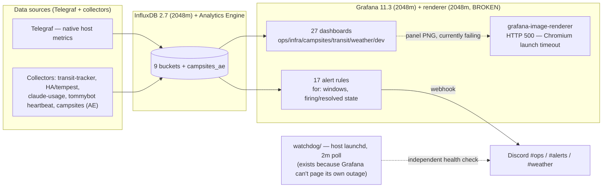
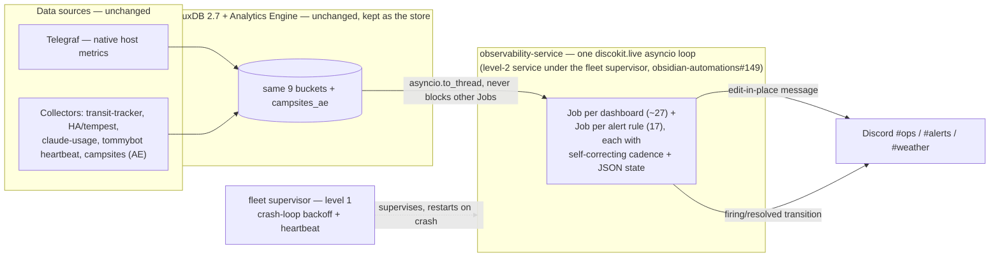

# Grafana → Asyncio-Loop Migration Plan — Dashboards & Alerting

Replace Grafana's role as the ops-dashboard and alerting layer with the
**asyncio-loop pattern already proven twice in this repo** (`discord-mini-mem`,
`discord-orbstack-mem`) and once upstream in `discobots` (`discokit.live`) — a
single supervised process that ticks a `Job` per dashboard/alert on its own
cadence and posts self-editing Discord messages, instead of a Grafana panel
behind a renderer. InfluxDB, Telegraf, and the data pipeline are **unchanged** —
this retires the *visualization + alerting engine*, not the *store*.

---

## TL;DR

| | |
| --- | --- |
| **Goal** | Zero Grafana (UI, query/alert engine, renderer) on `tommys-mac-mini`. Dashboards and alerts become `discokit.live` Jobs, one asyncio service, supervised as a level-2 service under the fleet supervisor (`obsidian-automations#149`). |
| **Mechanism** | Port each dashboard/alert to a `make_job()` that reads the *same* InfluxDB/AE query Grafana runs today and posts/edits a Discord message. Proven twice already in this repo (`discord-mini-mem` #132, `discord-orbstack-mem` #133) — this generalizes that pattern to the remaining 25 dashboards and all 17 alert rules, and consolidates on the `discokit` library instead of each port hand-rolling its own edit-in-place code. |
| **Alerting** | The hard part. Grafana's 17 rules aren't just queries — they carry `for:` duration windows and firing/resolved state. Each becomes a Job with its own tiny state machine (persisted the same JSON-per-job way discokit already does), dual-run against the live Grafana rule until confirmed equivalent. |
| **Keeps** | InfluxDB, Telegraf, Analytics Engine (campsites), `ask-dash`, `watchdog/`. This is a consumer swap, not a data-layer change. |
| **Skips** | Evidence.dev (wrong tool — see [Explicitly out of scope](#explicitly-out-of-scope)). Removing InfluxDB itself (out of scope — see same section). |
| **Net effect** | Grafana + grafana-renderer containers (2048m/2cpu each, ~4GB of the mini's 8GB) go away. PR #127's renderer-Chromium blocker becomes moot — nothing needs a browser-rendered panel anymore. |

---

## Why

1. **The pattern is already proven, twice, in this exact repo.** `discord-mini-mem` (#132) and `discord-orbstack-mem` (#133) each read the *identical* data source a Grafana panel reads (the `dev-status` process snapshot; Telegraf's `docker_container_mem` series) and render it as a self-editing Discord message instead — 128m/0.25cpu each, vs. Grafana's 2048m/2cpu. This isn't a novel bet; it's finishing a migration already underway one dashboard at a time.
2. **The renderer is broken *right now* and blocks alert embeds.** PR #127 found `grafana-image-renderer` failing every `/render` call (Chromium launch timeout) — zero successful renders in 24h, with `collector-freshness` and `influxdb-write-health` alert embeds already depending on it. The asyncio-loop approach never needed a browser at all (mini-mem/orbstack-mem draw their own emoji-square treemaps in pure Python); this migration dissolves that blocker instead of requiring someone to fix headless Chromium.
3. **Memory is the actual constraint driving this.** The mini is 8GB; Grafana + renderer alone reserve 4GB of it (half the box), and tommybot's MLX inference (PR #124, `tommybot` repo) is already the primary memory-pressure risk. Freeing Grafana's reservation is a direct, mechanical improvement to the same headroom problem, not a side effect.
4. **Grafana already can't be trusted to alert on its own outage.** `watchdog/` exists *because* of a real incident (2026-06-19→20, ~36h silent — see `CLAUDE.md`): Grafana's rules run inside Grafana, so when the container stack goes down, all 17 rules go dark with it. An out-of-process asyncio service, supervised independently (crash-loop backoff, heartbeat) by the fleet supervisor, is structurally the same fix `watchdog/` already applies — just generalized to every alert, not only the "is the stack up" case.
5. **It supersedes, rather than conflicts with, PR #127.** #127 frames the decision as *fix the renderer* (Option A) vs. *keep Grafana as query+alert engine, render bot-side via `ask-dash`* (Option B). This plan is the next step past both: don't keep Grafana as the engine either — move the query + alert logic itself into the asyncio loop. #127 is un-merged and has no comments as of this writing; recommend resolving it in favor of this plan rather than doing both.

---

## Architecture — before

## Architecture — after

**Gone after migration:** the `grafana` and `grafana-renderer` containers, `tailscale serve` exposure of Grafana, the Grafana OAuth/Tailscale-identity auth proxy (PR #99's work becomes moot once there's no UI to gate), and (eventually) `grafana/provisioning/**` — retained in git history, same as the campsites migration handled `campsites/`.

---

## What moves where

**By domain** (27 dashboards total; each becomes one `Job` reading the same query Grafana panel reads today):

| Domain | Dashboards | Status |
| --- | --- | --- |
| **Ops** (8) | stack-catalog, status-page, alerts-anomalies, backups, collector-freshness, walksheds-uptime, obsidian-backups, backend-deployment | Not started |
| **Infra** (7) | mac-system, orbstack-containers, influxdb-buckets, influxdb-internals, ha-pi-system, channel-bot, tommybot-rag | **2 partially done** — `mac-system`'s process-memory panel → `discord-mini-mem` (#132); `orbstack-containers`' container-memory panel → `discord-orbstack-mem` (#133). Both dashboards have *other* panels (CPU/disk/net/swap) still Grafana-only. |
| **Campsites** (3) | campsite-availability, campsite-collector-history, campsite-predictions | Not started — reads Analytics Engine, not InfluxDB; otherwise identical port shape |
| **Transit** (4) | transit-tracker-basic, transit-tracker-monitor, transit-alerts, transit-station-availability | Not started |
| **Weather** (2) | tempest-basic, indoor-climate | Not started |
| **Dev** (3) | claude-usage, runtime-versions, tommybot-vecserve | Not started |

**Alerting** (17 rule files, `grafana/provisioning/alerting/`) — ports as a `Job` per rule with its own firing/resolved state, not a 1:1 query swap:

| Rule file | Rules | Special handling |
| --- | --- | --- |
| `influxdb-availability.yml` | influxdb-down (critical) | **Primary pager** — the rule `watchdog/` was built to back up. Preserve or improve the out-of-band property; don't regress it. |
| `container-health.yml` | oomkilled, mem-near-limit (15m), restart-loop (15m) | Duration-window state per container |
| `disk-space.yml` | disk-volumes-dev, disk-mac-root (85%) | Simple threshold |
| `influxdb-write-health.yml` | write-errors, dropped-points, failed-queries (10m) | Rate-of-increase over window (`spread()` semantics) |
| `backup-stale.yml` | backup-stale, backup-stale-r2-dev (26h) | Staleness window |
| `system-restart.yml` | mac-restarted, boot-chain-degraded | Delta/edge detection |
| `collector-freshness.yml` | transit-tracker, home-assistant, tempest (15m) | Staleness window |
| `control-loop-stale.yml` | obsidian-control-loop-stale | Staleness window |
| `channel-bot-health.yml` | channel-discord-down | Simple threshold |
| `vecserve-down.yml` | vecserve-down | Simple threshold |
| `weather-alerts.yml` | 5 rules (wind/freeze/heat/rain/lightning) → **#weather**, not #alerts | Route to second Discord contact point |
| `campsite-collector-*.yml` | failure-ratio, freshness, inactive (3 rules) | Reads Analytics Engine, not InfluxDB |

---

## Migration steps

### Phase 1 — Consolidate the proven pattern onto `discokit` itself
`discord-mini-mem` and `discord-orbstack-mem` are hand-rolled — they predate/duplicate `discokit`'s abstraction rather than using it. Before scaling to 25 more dashboards, re-platform these two onto `discokit.live`'s actual `Job`/`Dashboard`/`Poster` classes (vendored or added as a dependency from `discobots`), proving the library itself — not just the idea — runs stably in this repo's OrbStack environment. Note: `discobots` PR #17 (which composed multiple dashboards into one `live_service.py` process) was **closed unmerged** — treat it as a design reference, not an importable dependency; this repo's `observability_service.py` will need to be written fresh, following the same `make_job()` / `build_jobs()` shape.

### Phase 2 — Pilot 3 single-purpose, alert-free dashboards
Pick low-complexity, high-value targets with no attached alert rule: `tommybot-vecserve`, `channel-bot`, `walksheds-uptime`. Pure `Job`-per-dashboard ports, run **in parallel** with the existing Grafana dashboard (nothing is turned off — this is strictly additive). Confirm parity for at least a week before proceeding.

### Phase 3 — Bulk-port the remaining read-only dashboards
Domain by domain (infra → transit → weather → dev → campsites-overview), each as its own small PR — consistent with `COORDINATION-PLAN.md`'s existing model of many small, conflict-free concurrent changes rather than one large rewrite. Finish the two partial dashboards (`mac-system`, `orbstack-containers`) by porting their remaining panels, not just declaring the ported panel "done."

### Phase 4 — Port the 17 alert rules
Higher scrutiny than dashboards: each rule needs its `for:` duration window and firing/resolved transition reimplemented as a small per-rule state machine (JSON-persisted, same as dashboard state). Dual-run every rule — new Job posts alongside the still-live Grafana rule — until each has been observed to fire *and* resolve correctly at least once. `influxdb-down` (the primary pager `watchdog/` backs up) gets the most scrutiny: confirm the new architecture's own out-of-band supervision (fleet-supervisor crash-loop detection + heartbeat) actually matches or beats today's guarantee before retiring anything Grafana-side.

### Phase 5 — Retire Grafana
Only after every dashboard + alert has a merged, confirmed-equivalent replacement:
1. Stop `grafana` + `grafana-renderer` containers (frees ~4GB).
2. Archive `grafana/provisioning/**` (git history retains it — same treatment as `campsites/` got in the Cloudflare migration).
3. Remove the `tailscale serve` exposure and the Grafana OAuth/Tailscale-identity auth proxy config (PR #99).
4. Update `CLAUDE.md` / `AGENTS.md` / `COORDINATION-PLAN.md` — the dashboards-as-code, conf.d, and coordinator-deploy sections stop describing reality once there's no Grafana provisioning left to coordinate.

### Phase 6 — Docs / tracker
Update the obsidian project tracker note the same way the Cloudflare migration did (auto-crosslinked; don't hand-edit — see `Cloudflare-migration-plan.md` Phase 7 for the pattern). File a task note tracking this as ongoing work until Phase 5 lands.

---

## Rollback

Every phase is independently reversible **until Phase 5**: Phases 1–4 only *add* asyncio Jobs running alongside the untouched Grafana stack — reverting is `git revert` on the relevant commits, and nothing is deleted. Phase 5 is the point of no return; keep `grafana/provisioning/**` in git history (never force-delete) and confirm at least a week of the new alerting matching Grafana's before stopping the containers.

---

## Open questions / risks

1. **Alert semantics are the real work, not the query port.** A subtly wrong `for: 15m` window or a missing `noDataState`/`execErrState` policy is a silent regression, not a bug that announces itself. Budget real review time here, not just for dashboards.
2. **Who watches the watcher?** Today, `watchdog/` exists specifically because Grafana can't detect its own outage. The new asyncio service is a single process too — confirm the fleet supervisor's crash-loop backoff + heartbeat genuinely covers this, or keep `watchdog/` pointed at the new process instead of retiring it.
3. **`live_service.py`'s multi-job composition isn't a merged dependency.** It's a closed-PR prototype in `discobots`. Budget time to re-derive it here rather than assuming it can be imported directly.
4. **Interactive exploration is a real loss.** Grafana's ad-hoc time-range picker, zoom, and drill-down have no Discord-embed equivalent — these are fixed snapshots. For genuinely exploratory use (rare, but real), decide what the deep-dive escape hatch is before Phase 5 removes Grafana entirely (PR #127 kept the full UI for exactly this reason).
5. **27 dashboards by hand is real effort.** Not every panel needs to move — low-traffic, rarely-viewed dashboards can stay on Grafana indefinitely if Phase 5 is deferred, or be dropped outright if nobody's looked at them in months. "Done" should mean "the paging-critical and daily-glance majority migrated," not literally every JSON file.
6. **Two-repo touch for campsite dashboards.** The 3 campsite dashboards already read Analytics Engine (post-Cloudflare-migration) — this port doesn't touch `robot-geographical-society`, only how observability-config renders what's already there.

---

## Explicitly out of scope

- **Evidence.dev.** The comment that originally sparked this idea (`obsidian-automations#179`) proposed Evidence for "live/rich dashboards." It isn't that: Evidence is a static-site generator (Node.js ≥18.13, npm ≥7) that runs its SQL queries **once at build time** and re-renders only on a triggered/scheduled rebuild — "live" means "rebuild the whole site again," on an interval, not query-per-view. It also ships **no alerting engine** at all. That's a materially different tool than what Grafana's alerting and live-ops dashboards need, and it would add a Node.js toolchain to a stack that's deliberately Python-only and already memory-tight. It may be a reasonable choice for an unrelated, separate idea later (e.g., an occasional BI-style historical trend report), but it is not part of replacing Grafana and is not recommended here.
- **Removing InfluxDB.** `tommybot`'s "InfluxDB exits" (PR #3) is sometimes cited as a precedent, but it isn't one for this: that was tommybot's own single-producer, single-consumer telemetry, replaced with an in-process SQLite cache. InfluxDB here is a **shared, multi-producer store** — Telegraf, transit/weather/campsite collectors, claude-usage, and tommybot's own heartbeat all write into it independently of Grafana. This plan changes who *reads* InfluxDB for visualization/alerting; it does not touch who *writes* to it.

---

*Prior art: `discord-mini-mem` (#132), `discord-orbstack-mem` (#133) — the proven pattern this generalizes. Relates to PR #127 (headless-Grafana plan — recommend resolving in favor of this one). Precedent for this document's shape: `Cloudflare-migration-plan.md`.*
