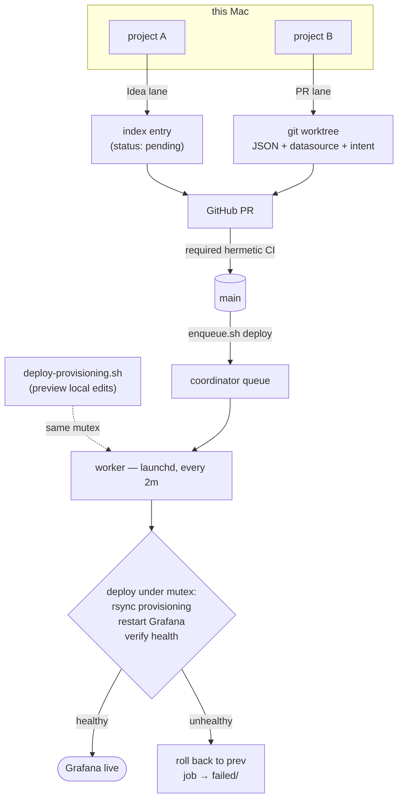
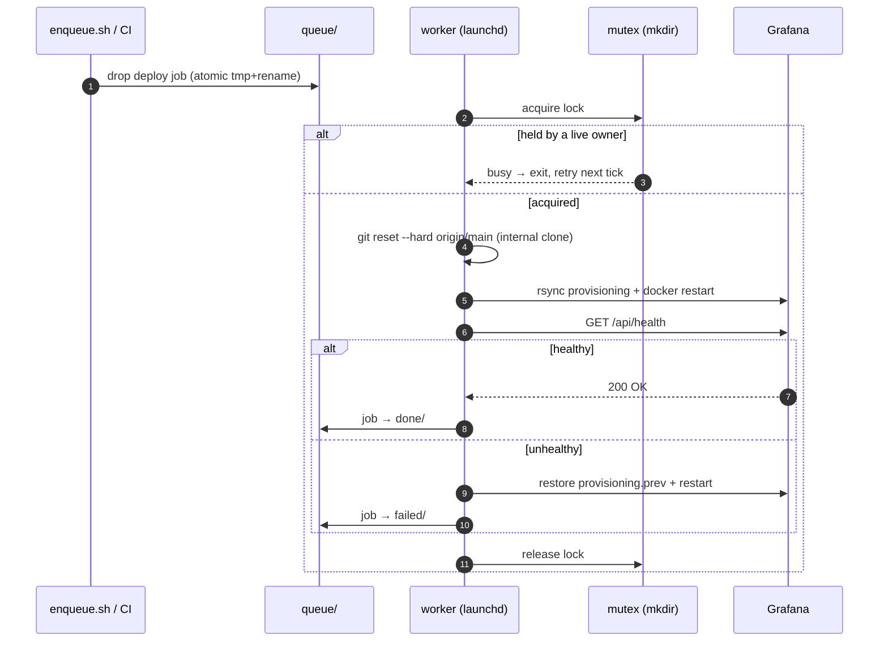

# observability-config

Infrastructure-as-code for the home observability stack running on
`tommys-mac-mini` (Tommy's Mac mini). Two OrbStack containers, file-provisioned:

- **`grafana/`** — Grafana 11.3 (OSS). Dashboards + datasources are
  file-provisioned (no clicking in the UI as source of truth). Also contains
  `dev-status/`, a small host collector that feeds the *Dev Deployments &
  Tailscale Serves* section of the status page.
- **`influxdb/`** — InfluxDB 2.7. Time-series store + daily backup job.

## Layout

The repo lives at `/Volumes/dev/observability/` and is the version-controlled
source of truth. Grafana provisioning is **no longer bind-mounted from `/Volumes`**
(the external disk's unmount/TCC fragility broke containers on 2026-05-31); Grafana
now mounts an internal-disk copy at `~/.observability/grafana/provisioning`. Edit
`grafana/provisioning/` here, then run `grafana/deploy-provisioning.sh` to sync
repo → internal and reload. Datasource/token/`docker-compose` changes still need a
`docker compose up -d` recreate from the relevant subdir.

## Coordination & deployment

Multiple projects on this machine contribute dashboards concurrently, so the repo
has a coordination layer (full design in **[COORDINATION-PLAN.md](COORDINATION-PLAN.md)**;
operational details in **[coordination/README.md](coordination/README.md)**):

- **Two contribution lanes.** *Idea* — drop a `status: pending` index entry. *PR* — a
  full dashboard (JSON + datasource + intent) via a normal PR. Concurrent additions are
  made conflict-free by moving toward one-file-per-dashboard (`dashboards.index.d/`,
  `datasources/_projects/`) so nobody edits a shared file (Phase 1+).
- **Merges** go through normal squash PRs gated by the required `hermetic` check. (No
  merge queue — it needs GitHub Pro or a public repo, and merge *ordering* is a low-stakes
  race for a solo repo; the deploy serializer below covers the real collision risk.)
- **Deploys are scheduled, not raced.** A launchd coordinator (`com.tommy.observability-coordinator`,
  every 2 min, running off an internal-disk clone) drains a queue and runs the one
  serialized step — sync provisioning, restart Grafana, **verify health, roll back on
  failure** — behind an atomic `mkdir` mutex. Both the scheduler and an interactive
  `deploy-provisioning.sh` take that same mutex, so they can't collide. Set it up with
  `coordination/install.sh`; enqueue a deploy with `coordination/enqueue.sh deploy "<reason>"`.
- **Stretch:** per-dashboard **blue-green deploys** — stage changed dashboards under a
  `-green` uid, verify render + query, and only then promote (COORDINATION-PLAN.md §13).

### How a change reaches the live dashboards

### The serialized deploy step

## Secrets

Secrets live in per-dir `.env` files (gitignored). Templates are committed as
`.env.example`. Copy and fill them in before `docker compose up`.

## Versioning replaces the old R2 backup

Config used to be tar-snapshotted to Cloudflare R2 by a daily LaunchAgent. That
job was never fully wired (token lacked access; agent wasn't loaded) and has been
removed in favor of this repo — git gives real diffs, history, and an offsite
copy on GitHub in one move.
