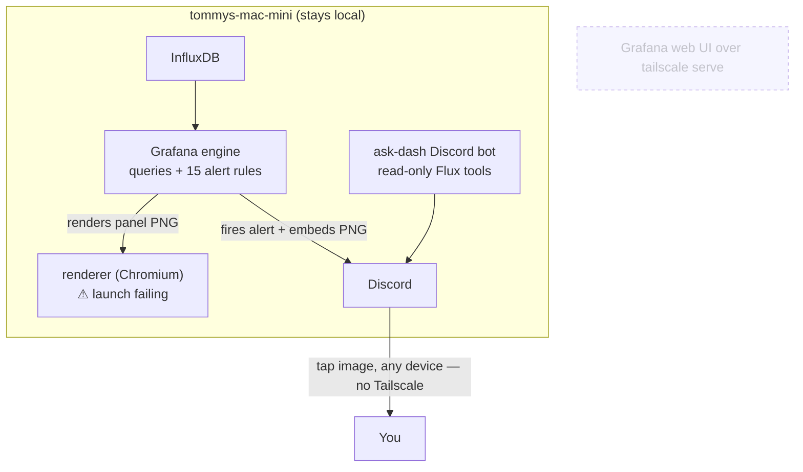

# Headless Grafana Migration Plan

Stop *browsing* Grafana. Keep Grafana + InfluxDB + the provisioned alert rules running
on `tommys-mac-mini` as the **engine** (query, alerting, image rendering), but retire the
human-facing web UI exposed over Tailscale. Day-to-day observability becomes **Discord +
static panel renderings** — an alarm or a bot command posts a PNG you tap, no tailnet, no
browser, no heavyweight UI for the occasional glance.

This plan also records a **blocker discovered while validating the approach**: the panel
renderer — the linchpin of "static renderings" — is currently **non-functional**.

---

## TL;DR

| | |
| --- | --- |
| **Goal** | Drop the Grafana **UI** (the `tailscale serve` :3000 exposure + tailnet dependency); keep Grafana + renderer running as the alerting + image-rendering engine. |
| **Why** | The full Grafana web UI is overkill for occasional checks; the want is "tap a Discord alarm → see a panel," from any device, no Tailscale. |
| **Keeps** | InfluxDB (local), all 15 provisioned alert rules → Discord, the `grafana` container as query/alert/render engine. |
| **Removes** | Human browse path only (`tailscale serve` for Grafana). No dashboards/datasources/alerts deleted. |
| **Blocker** | **Image rendering is broken right now.** The renderer's headless Chromium fails to launch (`websocket url timeout reached`) on *every* render — including a no-datasource panel. Zero successful renders in the last 24h. |
| **Decision needed** | How to produce the static PNGs: **(A)** fix Grafana's headless-Chromium renderer, or **(B)** render bot-side from `ask-dash` and delete the renderer. |

> _"Rendering is fully server-side and needs no UI — but the renderer it depends on isn't producing images today. Fixing or replacing it is step zero, not an afterthought."_

---

## The finding — renderer is down (evidence)

Validated live against the running stack on 2026-06-29 by calling the render API directly
(`GET /render/d-solo/<uid>/x?panelId=N&…`, service-account token):

- **Every render → HTTP 500.** Grafana accepts the call, dispatches to the renderer, the
  renderer calls back — wiring is correct, **no UI involved** (this is the proof headless
  rendering is *architecturally* fine).
- **Root cause is Chromium launch, not data.** Renderer log:
  `failed to run browser: websocket url timeout reached` (~21s), and the renderer sits
  **idle (13 MB, no Chrome process)** between attempts — Chrome dies on spawn each time.
- **Ruled out:** not the UI; not InfluxDB (a **no-datasource `text` panel** failed
  identically); not architecture (renderer image is **arm64-native** on an arm64 host, no
  emulation); not shared memory (**`/dev/shm` 2 GB, 0% used**).
- **Not "works until headless" — it isn't working now.** The only `/render` hits in 24h of
  Grafana logs are the three test calls above, all 500. No alert-screenshot renders have
  succeeded in that window either.
- **Host was under load during the test:** load avg 5–8; InfluxDB pegging ~1.5 cores inside
  the OrbStack VM (surfaces as "OrbStack Helper ~47%" on the host) with Flux queries timing
  out. Chrome launch is CPU-heavy, so host saturation is at minimum a strong contributor.

Renderer config today (`grafana/docker-compose.yml`): `grafana/grafana-image-renderer`
(digest-pinned), `mem_limit: 2048m`, `cpus: 2.0`, `RENDERING_MODE: default` (fresh Chromium
per render). Discord alert embeds already depend on this renderer
(`collector-freshness`, `influxdb-write-health` rules attach the "offending graph").

---

## What "headless" means here

Grafana has **no headless config flag** — it is always a server with a web UI. "Headless"
is an *operational* choice:

- **Keep running:** `grafana` (query + alert engine + render orchestrator), `renderer`
  (PNG producer), InfluxDB, Telegraf. Alerting is **inside Grafana** (15 provisioned rules
  → Discord contact point) — it does not move.
- **Remove:** the `tailscale serve` exposure of Grafana :3000 (today: tailnet-only,
  Tailscale-identity auth proxy). The UI stops being something you open.
- **Footprint reality:** this simplifies *access*, not *load*. The renderer
  (headless Chromium) is the heaviest, most fragile component — and we keep it under
  Option A. Shedding the renderer (Option B) is the only path that actually lightens the box.

---

## The decision: how to produce the static renderings

**Option A — fix & keep Grafana's renderer.** Least new code; reuses Grafana's own panel
rendering. Steps: restart the renderer and retry when the host is quiet; if still failing,
raise the browser/websocket launch timeout, add Chromium launch flags, and/or set
`RENDERING_MODE: clustered`. Keeps a headless-Chromium dependency — the heavy, brittle
piece this migration is trying to move away from. *(These are live-stack changes — a human
applies them via the coordinator; not done in this PR.)*

**Option B — render bot-side, delete the renderer (recommended).** Static PNGs for Discord
do not require Chromium — and the service to produce them **already exists in this repo**.
`ask-dash/` is a long-running OrbStack container that today answers natural-language
questions over the stack, exposed two ways from one shared tool core
(`ask_dash/tools.py`): a **Discord gateway bot** (`/ask` slash command) and an **MCP
server** for Claude CLI sessions. That core is already read-only and already connected to
exactly the right places:

- holds a **read-scoped InfluxDB token** (all buckets) + a **Grafana viewer token** —
  read-only is enforced by the credentials, not the prompt;
- ships data tools `list_buckets` · `list_measurements` · read-only `query_influx` (Flux) ·
  `search_dashboards` · `get_dashboard_queries`;
- is already wired into Discord as a deployed bot.

So bot-side rendering is an **extension of an existing, deployed service**, not a new one:
add a tool/command (e.g. `/dash <panel>` alongside `/ask`) that runs a Flux query and draws
the result with a lightweight server-side library (matplotlib / Vega / QuickChart), then
posts the PNG to the channel. Removes the single most fragile and heaviest component
(headless Chromium), is far more robust than spawning Chrome per image, and matches the
"lightweight, Discord-clickable" goal. Cost: panels are re-drawn in code rather than reusing
Grafana's rendering, and the alert-embedded graphs (`collector-freshness`,
`influxdb-write-health`) must be repointed to the bot path.

---

## Phased rollout

1. **Unblock rendering (decision above).** Nothing else proceeds until PNGs are produced
   reliably — it is the foundation of the whole approach.
2. **Wire a `/dash <panel>` Discord path** — on-demand render → PNG → channel post. Under
   Option B this is a new command/tool in the existing `ask-dash` bot; under Option A it
   calls the Grafana render API.
3. **Confirm alert-embed images** post correctly end-to-end (the existing
   `collector-freshness` / `influxdb-write-health` embeds, re-validated).
4. **Drop the Grafana UI exposure** (`tailscale serve` for :3000) once Discord coverage is
   trusted for routine checks.
5. **Revisit footprint** — under Option B, retire the `renderer` container entirely.

---

## Risk & rollout

- **Reversible.** Removing the UI exposure is config; nothing is deleted. Re-expose
  Grafana over Tailscale at any time.
- **Interactivity loss is real.** Static images have no zoom, time-range picker, hover, or
  drill-down. Each PNG is a fixed window; changing it means re-rendering. Acceptable for
  "occasional checks"; the full UI remains the escape hatch for deep dives.
- **Alerting is unaffected** by going headless — it already runs server-side. But under
  Option B the alert-embedded graphs must be repointed to the bot renderer.
- **This PR changes no live config** — it records the finding and the plan. Renderer fixes
  and the UI-exposure change are applied by the maintainer/coordinator after the path is
  chosen.
